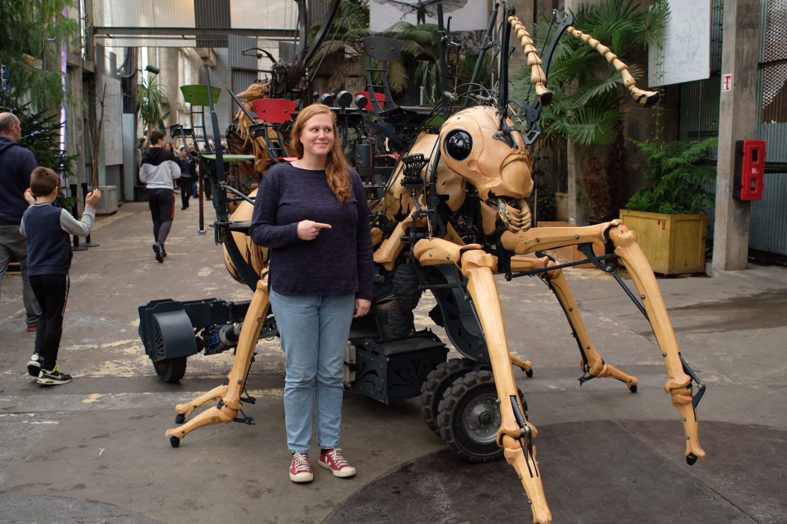

# Evolution, bioinformatics, genomics & social insects

I am an evolutionary biologist, currently finishing a PhD in ant genomics in London at [Queen Mary University of London](http://www.sbcs.qmul.ac.uk/research/) in [Yannick Wurm's lab](https://wurmlab.github.io/team/efavreau/index.html).
My PhD project title is _One or multiple ant queens? The genetic architectures underlying convergent evolution of a fundamental social trait_. Read more about what I have been up to in [a Myrmecological News interview](https://blog.myrmecologicalnews.org/2019/03/20/doing-an-ant-phd-emeline-favreau/) and [The Biologist's A Day in the Life of](Biologist_interview.png).

_December 2018: Checking out the local ant art in Nantes_

I am interested in understanding molecular mechanisms underlying speciation, adaptation, interactions between species.

My current model system is the group of social insects: ants, bees, wasps. I am fascinated by all evolutionary dynamics, such as costs and benefits of phenotypic and molecular evolution, sex and no-sex evolution, origins of selfish elements, evolutionary consequences on complex ecosystems tempered by human activities, ecology and evolution of host-parasite interactions, interactions between the genome and environment, diseases caused by genetic changes ([see our French outreach website on Batten disease](http://cln.jmfavreau.info/index.html)).
