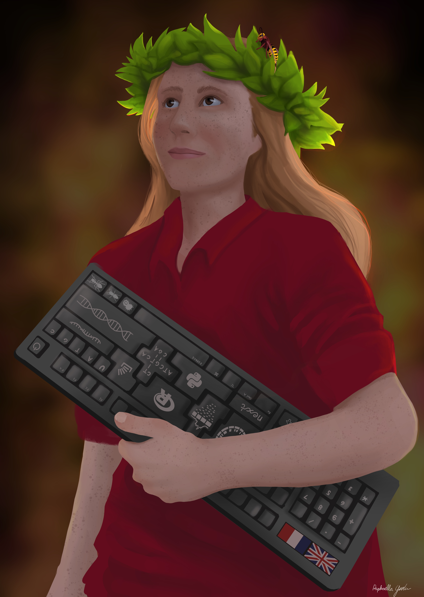

# Evolution, bioinformatics, genomics & social insects

I am interested in understanding molecular mechanisms underlying speciation, adaptation, interactions between species. My current model system is the group of social insects: ants, bees, wasps. I am an evolutionary biologist, currently working with [Seirian Sumner](https://www.ucl.ac.uk/biosciences/people/dr-seirian-sumner) at UCL in London. My postdoc position gives me the opportunity to explore the evolution of social organisation of wasps.

 _Summer 2020: Artwork by Raphaella Jackson (check her [Instagram @alanin_artwork](https://www.instagram.com/alanin_artwork/))_

I was recently awarded a PhD in ant genomics in London at [Queen Mary University of London](http://www.sbcs.qmul.ac.uk/research/) in [Yannick Wurm's lab](https://wurmlab.github.io/team/efavreau/index.html).
My PhD project title is _One or multiple ant queens? The genetic architectures underlying convergent evolution of a fundamental social trait_. Read more about what I was doing in [a Myrmecological News interview](https://blog.myrmecologicalnews.org/2019/03/20/doing-an-ant-phd-emeline-favreau/) and [The Biologist's A Day in the Life of](Biologist_interview.png).

I also keep an eye on human biology literature, [see our French outreach website on Batten disease](http://cln.jmfavreau.info/index.html).
