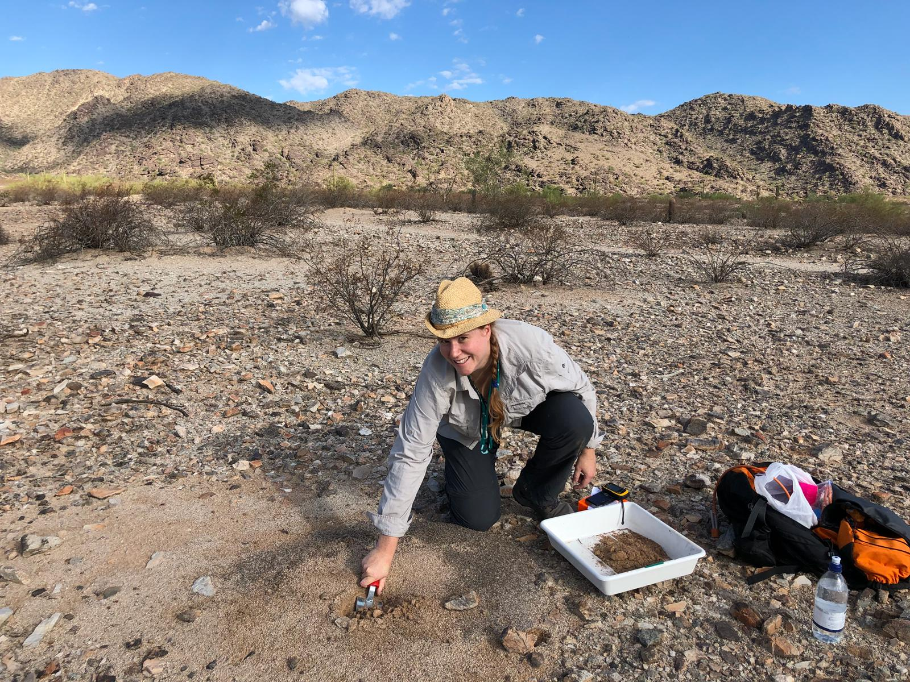

### Research position
- 2023 - ongoing: Bioinformatician in rare disease in [Prof Chris Wallace's lab](http://chr1swallace.github.io/).
- 2019 - 2023: NERC-funded Postdoc in [Seirian Sumner's lab](http://www.sumnerlab.co.uk/the-group/emeline-favreau/), in collaboration with Katie Geist, [Amy Toth](https://www.ent.iastate.edu/people/amy-toth) and [Sandra Rehan](http://www.rehanlab.com/). This highly collaborative postdoc focuses on understanding the origins of sociality in the wasps and the bees: comparative transcriptomics and genomics.

### Education
- 2015 – 2019: PhD in ant genomics, [QMUL](https://www.qmul.ac.uk/sbcs/staff/emelinefavreau.html). Supervisors: Yannick Wurm and Max Reuter. [NERC-funded Doctoral Training Programme](https://london-nerc-dtp.org/).
- 2013 - 2014: MRes Biosystematics at Imperial College London & Natural History Museum, London (NHM).
- 2008 - 2011: BSc Environmental Sciences at Oxford Brookes University, Oxford 1st Class (Hons).

### Technical
- Bioinformatics for population genetics & genome/transcriptome wrangling
   - R current favourite packages: ggplot, tidyverse, adegenet
   - Python: matplotlib, pandas, numpy
   - Bash: tmux, vim, sbatch, qsub
   - Database: mysql (creating new schema, updating current database, extracting data for management and curation)
   - Pipeline optimisation: HPC resource management to tailor Nextflow pipeline nf-core/sarek to a large re-mapping project
   - Reproducibility: RMarkdown reports, Github version control, Nextflow (nf-core/rnaseq), Singularity, Docker
   - _De novo_ genome assembly (PacBio, MinION, Illumina, HiC), genome annotation (genes, lncRNA, TE), variant calling (SNP, SV, copy number variant), GWAS, population genomics
   - RNAseq QC and Transcriptome analyses: DESeq2, WGCNA
   - Machine learning: Support Vector Machine (to predict caste from wasp RNAseq data)
   - Data Management: I defined the strategy for long-term data storage for the Sumner Lab, and developed a system for all members to safely save their data (genomes, transcriptomes, annotations)

- Wet lab skills for sequencing (short and long reads)
   - RNA / DNA extraction and QC (all developmental stages of insect)
   - Primer selection
   - Library preparation for microsatellite, whole-genome sequencing (Illumina and MinION), RNAseq

- Fieldwork in temperate, semi-tropical and desertic areas (usually looking at ants and wasps)

_September 2018: Checking out the local ants in Arizona_

### Talks & posters
- March 2022: **international invited talk** ("Wasp and Bee Evolution") for GRIB group at IMIM-Pompeu Fabra (Barcelona)
- June 2021: talk ("European hornet genome sheds light on the molecular basis of superorganisms") at UCL CLOE Seminar, in London (online)
- March 2021: international poster presentation at Cold Spring Harbour’s Virtual Conference Biology & Genomics of Social Insects (online)
- January 2021: postdoc presentation at UCL CBER (online)
- July 2020: international V-poster at Arthropod Genomics Symposium ([online](http://i5k.github.io/ags2020))
- Jan 2020: postdoc presentation at UCL GEE Seminar, in London
- Sept 2018: **international invited talk** for Ramírez's group, UC Davis, California (USA)
- Sept 2018: **international invited talk** at Social Insect Research Group, Arizona State University, Arizona (USA)
- Sept 2018: talk at NERC DTP conference _A Changing Planet_, in London
- Aug 2018: poster at international joint _ESEB_ and _Evolution_ conference, in Montpellier (France)
- Aug 2018: talk at international _IUSSI Brazil_ conference, in Guaruja (Brazil)
- Mar 2018: **invited talk** for the UCL GEE Seminar, in London
- Aug 2017: international poster at _ESEB congress_, in Groningen (Netherlands)
- June 2017: international talk at _Evolution_ conference, in Portland, Oregon (USA)
- Feb 2017: poster at QMUL SBCS Postgraduate Symposium, in London
- Jan 2017: talk at _PopGroup_, in Cambridge
- Dec 2016: talk at North-West section of _IUSSI_ Winter Meeting, in London
- Sept 2016: poster at NERC DTP conference _Perspectives on Environmental Change_, in London

 
### Grants, honours & awards
- 2020: ESEB's Godfrey Hewitt Mobility award - €1600
- 2019: Genetics Society grant to give a talk at PopGroup - £150
- 2018: QMUL PostGraduate Research Fund for Arizona &  California fieldtrip - £1200
- 2018: IUSSI North-Western Section grant to organise a symposium at IUSSI Brazil – £1000
- 2018: Royal Entomological Society grant to organise a symposium at IUSSI Brazil - £450
- 2018: Royal Society of Biology grant to organise a symposium at IUSSI Brazil - £500 [PDF report](https://www.rsb.org.uk/images/pdf/Travel_Grant_report_2018_Favreau_Emeline.pdf)
- 2017: Genetics Society grant to give a talk at PopGroup - £150
- 2017: Genetics Society grant to present a poster at ESEB - £624
- 2015: PhD Scholarship from London NERC DTP - £7500
- 2014: Royal Entomological Society grant to present a poster at 2nd Young Natural History Scientists’ Meeting (2014, France)
- 2013: Scholarship awarded from Entente Cordiale (Masters of Research)
- 2013: Study grant from Ruby and Will George Trust (Masters of Research)
 

### Teaching
- Nov 2020 and 2021: Teaching "Molecular Tools for Ecologists" to 80 UCL Undergraduate students. Lecture, exam preparation and marking.
- Nov 2019 - ongoing: mentoring students in Seirian Sumner's lab. 
	- 1st year Undergraduate Summer project student Jadesada Schneider (bioinformatics)
	- 3rd year Undergraduate Autumn project student Shin Khan (R)
	- MRes Winter project student Phoebe Cunningham (R)
   - Msci Winter project student Quinn Coxon (bioinformatics)
- Sept 2016 - Sept 2019: Teaching assistant for 8 cohorts of QMUL Undergraduates and Masters classes, including Fieldwork (Tropical Ecology in South Africa), Bioinformatics (R Basics, Advanced R, Bash for Genomics), Basic Biology lab skills (dilution, microscopy, PCR).
- Dec 2017: Lecturer during Undergraduate Tropical Ecology Module in South Africa (_Wildlife and Human Interactions_)
- Jan - Aug 2017: Design and Supervising Master student project. With Gino Brignoli, focussing on social organisation of yellow meadow ants, involving fieldwork and genetic analyses.

### Outreach
- 2022: invited talk at [Pint of Science](https://pintofscience.co.uk/) for a London pub crowd
- 2021: Science expert on an episode of [Exolore podcast](https://www.exolorepod.com/episodes): World of Migratory Wasps
- 2019-22: Science pen pal with a US-based student from [Letters to a Pre-Scientist](https://www.prescientist.org/). Exchanging four letters a year.
- 2018: QMUL Festival of Communities in London
- 2017: [Science SoapBox](http://www.sciencesoapbox.org/) volunteer in Brighton
- 2014: NHM Researchers' Night in London
- 2013: NHM Big Nature Day in London

### Collaborative Project Organisation
- 2020: Postdoc representative for UCL GEE: setting up webpage and Slack forum for 200 postdocs.
- 2020: Principal coordinator of NWE IUSSI Winter Meeting in a small organising committee. The first of its kind online: Zoom, Slack, [Twitter](https://twitter.com/IUSSI_NWES), [Youtube](https://www.youtube.com/channel/UC1Hr003ATlXakc_Zzg7ESQA) for 200 participants from 4 continents.
- 2018: Organising the [QMUL Festival of Communities outreach day](https://wurmlab.github.io/news/2018-05-18-festival_of_communities/) among a small team of PhD students, specialising in equipment, transport, people logistics.
- 2017 – 18: Leading our conference committee to organise a [symposium](https://wurmlab.github.io/news/2018-02-15-iussi_symposium_evolution_of_social_organization/) during the international congress _IUSSI Brazil_, specialising in writing symposium abstract, selecting and reaching out to all speakers including keynote speaker, co-chairing the symposium.
- 2016 – 2019: Leading [the lab's monthly review of published articles](https://wurmlab.github.io/news/2018-02-20-Keeping_up_with_reading_newly_published_articles/), in which each lab member is responsible to summarise 3 journals' current issue.

### Learned societies member since
- 2015: [International Union for the Study of Social Insects](http://www.iussi.org/)
- 2016: [Genetics Society](http://www.genetics.org.uk/)
- 2016: [Royal Entomological Society](https://www.royensoc.co.uk/)
- 2017: [European Society of Evolutionary Biology](https://eseb.org/)
- 2018: [Society of Systematics Biologists](https://www.systbio.org/)
- 2019: [Society of Molecular Biology and Evolution](https://www.smbe.org/smbe)

### Reviewer for
- [ProcB](https://royalsocietypublishing.org/journal/rspb)
- [PeerJ](https://peerj.com/)
- Myrmecological News Blog
- Insect Science

_More details on [LinkedIn](https://www.linkedin.com/in/emelinefavreau/)_

_[PDF version](Emeline_Favreau_cv.pdf)_
