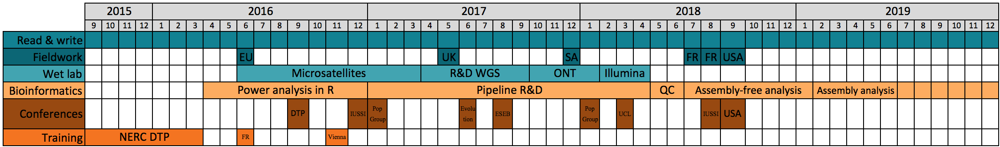

### Education
- 2019 - ongoing: Postdoc in [Seirian Sumner's lab](http://www.sumnerlab.co.uk/the-group/emeline-favreau/).
- 2015 – 2019: PhD in ant genomics, [QMUL](https://www.qmul.ac.uk/sbcs/staff/emelinefavreau.html). Supervisors: Dr Yannick Wurm and Dr Max Reuter. [NERC-funded Doctoral Training Programme](https://london-nerc-dtp.org/).
- 2013 - 2014: MRes Biosystematics at Imperial College London & Natural History Museum, London (NHM).
- 2008 - 2011: BSc Environmental Sciences at Oxford Brookes University, Oxford 1st Class (Hons).

### Technical
- Bioinformatics skills tailored for statistics and variant calling. Depending on needs, analyses conducted on my own computer or high performance computer:
   - R statistical package
   - Bash
   - Version control system
   - _De novo_ genome assembly
   - Variant calling
   - GWAS
   - Population genomics

- Wet lab skills tailored for sequencing (short and long reads). Depending on needs, I follow established protocols/kits, or design my own:
   - DNA extraction and QC
   - Primer selection
   - Library preparation for microsatellite and whole-genome sequencing (Illumina and MinION)

### Talks & posters
- Sept 2018: invited talk for Ramírez's group, UC Davis, California (USA)
- Sept 2018: invited talk at Social Insect Research Group, Arizona State University, Arizona (USA)
- Sept 2018: talk at NERC DTP conference _A Changing Planet_, in London
- Aug 2018: poster at joint _ESEB_ and _Evolution_ conference, in Montpellier (France)
- Aug 2018: talk at _IUSSI Brazil_, in Guaruja (Brazil)
- Mar 2018: invited talk for the UCL GEE Seminar, in London
- Aug 2017: poster at _ESEB congress_, in Groningen (Netherlands)
- June 2017: talk at _Evolution_ conference, in Portland, Oregon (USA)
- Feb 2017: poster at QMUL SBCS Postgraduate Symposium, in London
- Jan 2017: talk at _PopGroup_, in Cambridge
- Dec 2016: talk at North-West section of _IUSSI_ Winter Meeting, in London
- Sept 2016: poster at NERC DTP conference _Perspectives on Environmental Change_, in London

 
### Grants, honours & awards
- 2019: Genetics Society grant to give a talk at PopGroup - £150
- 2018: QMUL PostGraduate Research Fund for Arizona &  California fieldtrip - £1200
- 2018: IUSSI North-Western Section grant to organise a symposium at IUSSI Brazil – £1000
- 2018: Royal Entomological Society grant to organise a symposium at IUSSI Brazil - £450
- 2018: Royal Society of Biology grant to organise a symposium at IUSSI Brazil - £500 [PDF report](https://www.rsb.org.uk/images/pdf/Travel_Grant_report_2018_Favreau_Emeline.pdf)
- 2017: Genetics Society grant to give a talk at PopGroup - £150
- 2017: Genetics Society grant to present a poster at ESEB - £624
- 2015: PhD Scholarship from London NERC DTP - £7500
- 2014: Royal Entomological Society grant to present a poster at 2nd Young Natural History Scientists’ Meeting (2014, France)
- 2013: Scholarship awarded from Entente Cordiale (Masters of Research)
- 2013: Study grant from Ruby and Will George Trust (Masters of Research)
 

### Teaching
- Sept 2016 - Ongoing: Teaching assistant for 8 cohorts of QMUL Undergraduates and Masters classes, including Fieldwork (Tropical Ecology in South Africa), Bioinformatics (R Basics, Advanced R, Bash for Genomics), Basic Biology lab skills (dilution, microscopy, PCR).
- Dec 2017: Lecturer during Undergraduate Tropical Ecology Module in South Africa (_Wildlife and Human Interactions_)
- Jan - Aug 2017: Design and Supervising Master student project. With Gino Brignoli, focussing on social organisation of yellow meadow ants, involving fieldwork and genetic analyses.

### Outreach
- 2019: Science pen pal with a US-based student (Letters to a Pre-Scientist)
- 2018: QMUL Festival of Communities in London
- 2017: Science SoapBoax volunteer in Brighton
- 2014: NHM Researchers' Night in London
- 2013: NHM Big Nature Day in London

### Collaborative Project Organisation
- 2018: Organising the [QMUL Festival of Communities outreach day](https://wurmlab.github.io/news/2018-05-18-festival_of_communities/) among a small team of PhD students, specialising in equipment, transport, people logistics.
- 2017 – 18: Leading our conference committee to organise a [symposium](https://wurmlab.github.io/news/2018-02-15-iussi_symposium_evolution_of_social_organization/) during the international congress _IUSSI Brazil_, specialising in writing symposium abstract, selecting and reaching out to all speakers including keynote speaker, co-chairing the symposium.
- 2016 – ongoing: Leading [our monthly review of published articles](https://wurmlab.github.io/news/2018-02-20-Keeping_up_with_reading_newly_published_articles/), in which each lab member is responsible to summarise 3 journals' current issue.

### Learned societies member since
- 2015: [International Union for the Study of Social Insects](http://www.iussi.org/)
- 2016: [Genetics Society](http://www.genetics.org.uk/)
- 2016: [Royal Entomological Society](https://www.royensoc.co.uk/)
- 2017: [European Society of Evolutionary Biology](https://eseb.org/)
- 2018: [Society of Systematics Biologists](https://www.systbio.org/)
- 2019: [Society of Molecular Biology and Evolution](https://www.smbe.org/smbe)

### Reviewer for
- [PeerJ](https://peerj.com/)

_More details on [LinkedIn](https://www.linkedin.com/in/emelinefavreau/)_

_[PDF version](Emeline_Favreau_cv.pdf)_
