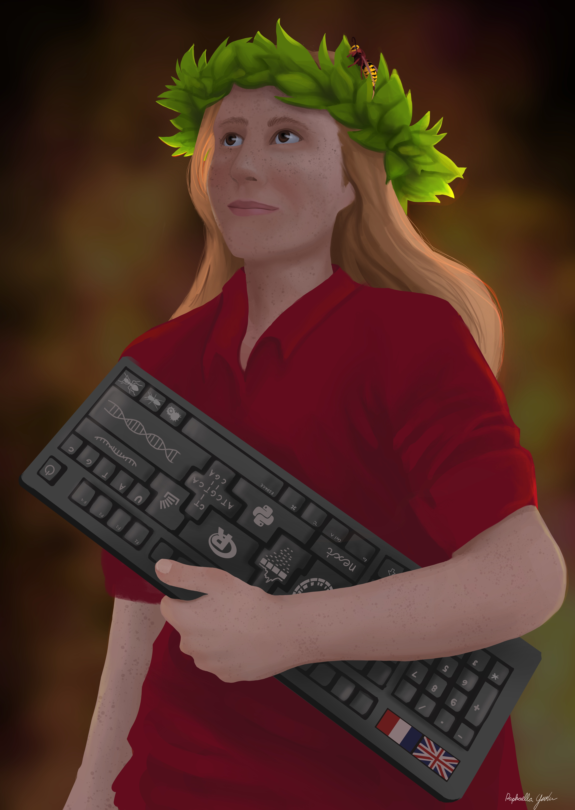

---
# You don't need to edit this file, it's empty on purpose.
# Edit theme's home layout instead if you wanna make some changes
# See: https://jekyllrb.com/docs/themes/#overriding-theme-defaults
layout: home
---
I study how social organisation of insects evolved, which leads me from field collection sites to whole-genome variants and transcriptomic analyses. Officially holding a PhD since February, my days as postdoc contain plenty of wasp bioinformatics analyses, writing-up sessions and mentoring.

**Contact me if you want to collaborate.**

 _Summer 2020: Artwork by Raphaella Jackson (check her [Instagram @alanin_artwork](https://www.instagram.com/alanin_artwork/))_
